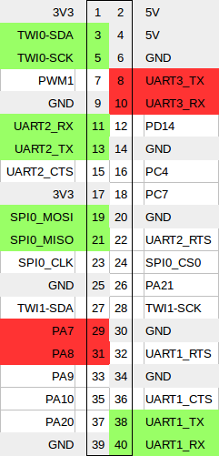

# STM32-Entwicklung

Dieses Dokument soll beschreiben, wie direkt auf dem Orange Pi Software für den verbundenen STM32-Microcontroller Software entwickelt werden kann.

## Anschlüsse

Dieser Abschnitt wird mit den ersten gefertigten Boards obsolet werden.

Die Pins am Orange Pi sind nicht beschriftet. Hier sind die Pins aufgelistet, wobei sich neben Pin 1 am Pi ein kleiner Pfeil befindet. Neben den roten Pins sind 5V und GND relevant.

Die Zuordnung ist wie folgt:

         Pi --- STM32
         GND … GND
          5V … 5V
         PA7 … BOOT0
         PA8 … NRST
    UART3_TX … PA10
    UART3_RX … PA9

## Flashen

Zum Flashen kann der [STM32Flasher](https://github.com/PRIArobotics/STM32Flasher) verwendet werden.
Hier ein schneller Überblick zur Installation:

* Für den Flasher wird [Python](python.md) benötigt.

* `git` ist auf dem Orange Pi nicht vorinstalliert, wird aber zur Installation von `STM32Flasher` benötigt (und ist auch ansonsten bei der Software-Entwiclung sehr nützlich):

        sudo apt-get -y install git

* Danach installiert man wie beschrieben `STM32Flasher`:

        python3 -m virtualenv env
        . env/bin/activate
        pip install git+git://github.com/PRIArobotics/STM32Flasher.git
        deactivate

* Nun kann man seine Programme auf den STM32 spielen (das Environment muss dazu nicht aktiviert sein):

        sudo env/bin/stm32flasher "$FILE"

## C Toolchain

Für den STM32-Microcontroller benötigt man die GCC-ARM-Toolchain, die folgendermaßen installiert wird:

    sudo apt-get -y install build-essential gcc-arm-none-eabi

Zusätzlich benötigt man den `unzip`-Befehl zum Entpacken der Standard Library:

    sudo apt-get -y install unzip

### STM32F303VCT6

Hedgehog basierte auf dem STM32F3 Discovery Board, das einen STM32F303VCT6 verbaut.
Wir stellen eine [Vorlage](https://github.com/PRIArobotics/STM32Template) für Projekte mit diesem Mikrocontroller zur Verfügung.

Das Makefile automatisiert die folgenden Setup-Schritte:

1. Standard Peripheral Library herunterladen und Entpacken

   Dies kann [hier](http://www.st.com/web/catalog/tools/FM147/CL1794/SC961/SS1743/LN1939/PF258144#orderable) heruntergeladen werden.
   Bitte beachte die darin angegebenen Lizenzbedingungen.

2. Kopieren der `.c`- und `.h`-Files der Projektvorlage nach `src` bzw. `inc`

   Diese befindet sich im folgenden Ordner:
   
        STM32F30x_DSP_StdPeriph_Lib_V.../Projects/STM32F30x_StdPeriph_Templates/

Automatisiert:

    # löscht ein heruntergeladenes Archiv und lädt es erneut herunter
    make download
    # löscht den entpackten Archiv-Inhalt und entpackt das Archiv erneut
    make unpack
    # Erstellt Ordner src und inc & kopiert die .c- und .h-Vorlage-Dateien dort hin.
    make template

Das Makefile referenziert alle benötigten Bibliotheken und stellt die folgenden wichtigen Targets zur Verfügung:

    # Löscht alle Binärdateien, etwa .o-, .elf, .bin und .map-Dateien
    make clean
    # Kompiliert und linkt das Programm. Das Ergebnis ist eine .bin-Datei
    make
    # Lädt das Programm auf den Microcontroller
    make flash

### STM32F4

[STM32F4xx](http://www.st.com/web/catalog/tools/FM147/CL1794/SC961/SS1743/LN1939/PF257901#orderable).

**TODO**

